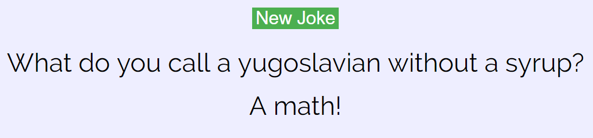
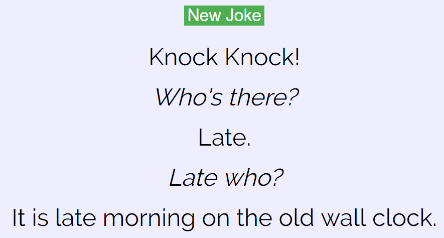

# Bad Joke Maker
Makes really bad and usually nonsense jokes.

### How to use

*Must have NodeJS installed*
 
 Clone or download repository
 
 Within directory in bash/cmd:
 
 `npm install`
 
 `node index.js`
 
 Connect to *localhost:8020* in a browser
